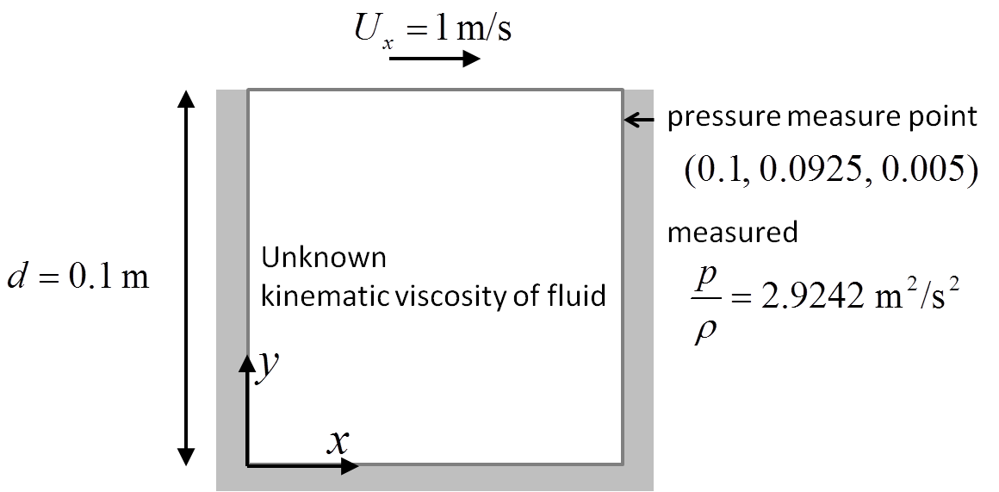
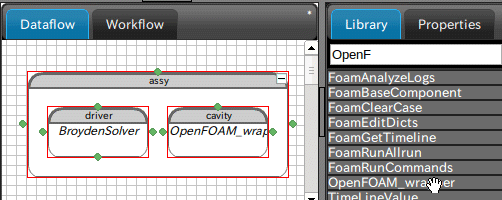
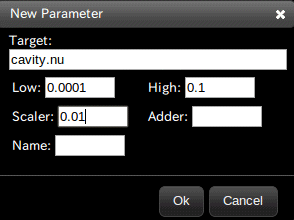
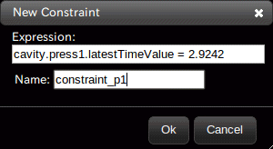
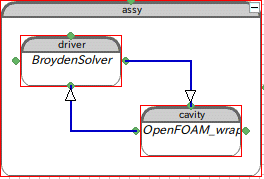
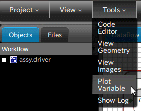

===========
Usage Guide
===========
本プラグインはPyFoamを用いたOpenFOAMのラッパーである。
OpenFOAMはESIグループのOpenCFD社とOpenFOAM財団開発している
オープンソースCFD(数値流体力学)ソフトウェアで、
PyFoamはOpenFOAMの実行を制御し、データを取り扱うための
Pythonライブラリである。

本プラグインはOpenMDAOのGUIからOpenFOAMを使うために作られたcomponentである。

PyFoamライブラリを用いてPython Scriptを作成する方が
自由度の高く、複雑なモデルを構築できる。

Overview
========
OpenFOAMのcavityチュートリアルを用いてパラメータの同定を行う。
次のようなcavity問題において、point1の圧力/密度の値が予め分かっている場合、
粘性係数(nu)をbroyden法を用いて同定する。

cavity caseの準備
==========================
OpenFOAM側の準備を行う。
OpenFOAMの利用できる端末より下記コマンドを実行する。

.. code-block:: bash
   :linenos:

   cd $FOAM_RUN
   cp -r $FOAM_TUTORIALS/incompressible/icoFoam/cavity .
   cd cavity

次にblockMeshを実行する

.. code-block:: bash
   :linenos:

   blockMesh

自動化を行うためのAllrunファイルを作成する(OpenFOAM_wrapperで利用するため)
今回は格子の変更は伴わないため、ソルバの実行を記したファイルを用意し、
実行権限を与える。

.. code-block:: bash
   :linenos: 

   echo '#!/bin/sh' >Allrun
   echo 'icoFoam>log.icoFoam' >>Allrun
   chmod +x Allrun
    
最後に、point1の圧力値を取得するため
controlDictの末尾に以下のfunction Objectの設定を追加する。

.. code-block:: cpp
   :linenos:

   functions
   {
       probes
       {
           type            probes;
           functionObjectLibs ("libsampling.so");
           enabled         true;
           outputControl   timeStep;
           outputInterval  1;
           fields
           (
               p
           );
           probeLocations
           (
               ( 0.1 0.0925 0.005 )
           );
       }
   }
    

以上でOpenFOAM側の準備は完了である。

.. _`GUIからの実行方法`:

GUIからの実行方法
=================
OpenMDAOユーザガイドの[Getting Started] - [GUI]に示されるようにプロジェクトを開く。
プロジェクトのウインドウが現れたら、右側サイドパネルから"Assembly"をデータフローウィンドウにドラッグする。
"Assembly"のドラッグ時に表示されるダイアログに、assyと入力する。

さらにAssemblyのdriverに"BroydenSolver"、componentに"OpenFOAM_wrapper"をドラッグする。
"OpenFOAM_wrapper"のドラッグ時に表示されるダイアログに、cavityと入力する。

    

cavity componentの設定
----------------------
まずは、OpenFOAM_wrapperクラスのインスタンスに、
対象の解析caseディレクトリを指定する。

cavity componentを右クリックし表示されるポップアップメニューから、Editを選択する。
ダイアルが表示されるのでInputタブのcase_dirにcavityと入力する。
これによりcavity componentは、絶対パスとして、もしくは$FOAM_RUN以下の相対パスとして
cavityを検索し、認識する。

case_dirを認識したOpenFOAM_wrapperが下記に示す処理を順に行うことで
解析の自動化を実現している。

    1. 解析結果の消去
    2. constant/transportProperties内のnuの編集
    3. Allrunの実行
    4. logファイルの分析とデータの取得
    5. function Objectsで取得したデータの取得

今回「1. 解析結果の消去」「3. Allrunの実行」についてはデフォルトの設定で良い上、
「4. logファイルの分析とデータの取得」も処理自体が不要である。
よって「2. :ref:`constant/transportProperties内のnuの編集`」と
「5. :ref:`function Objectsで取得したデータの取得`」の説明を以下で行う。

.. _`constant/transportProperties内のnuの編集`:

*constant/transportProperties内のnuの編集*
++++++++++++++++++++++++++++++++++++++++++
再び、cavity componentを右クリックし表示されるポップアップメニューから、
Editを選択し、ダイアログを表示させる。

foamEditKeywords行のvalue列の[object Object]欄をダブルクリックする。
表示されるダイアログに下記を入力し、"+" ボタンをクリックする。

================================  ===============================
           **Key**                         **Value**                              
================================  =============================== 
constant/transportProperties.nu   "nu [0 2 -1 0 0 0 0] %s" %(nu)                      
================================  =============================== 

foamEditKeywordsを変更されたcavity componentは、
自身にiotype:'in'のFloat型の変数nuを生成する(cavity.nuを生成する)。

cavity componentのEditから表示されるダイアログに、
nuが生成されていることが確認できれば、初期値0.1を入力する。

またcavity componentは実行(runメソッド)時に、
constant/transportPropertiesファイルの項目nuを"nu [0 2 -1 0 0 0 0] x"に変更して、
書き込む。(※ xはcavity.nuの値)

.. _`function Objectsで取得したデータの取得`:

*function Objectsで取得したデータの取得*
++++++++++++++++++++++++++++++++++++++++
引続き、cavity componentのEditから表示されるダイアログにて
foamGetTimelineKeywords行のvalue列の[object Object]欄をダブルクリックする。
表示されるダイアログに下記を入力し、"+" ボタンをクリックする。

=========  ============================
 **Key**             **Value**                              
=========  ============================ 
press1     postProcessing/probes/0/p|1                      
=========  ============================

foamEditKeywordsを変更されたcavity componentは、
自身にiotype:'out'のopenfoam_wrapper.openfoam_wrapper.TimeLineValue型の
変数press1を生成する(cavity.press1を生成する)。

実行(runメソッド)時に、
press1はpostProcessing/probes/0/pファイルの第1カラムを読み込む(0カラムはtime)。
press1はクラス変数にlatetTimeValueやaverageValue,minValue,maxValueなどを持つ。

case_dirの設定、「 :ref:`constant/transportProperties内のnuの編集`」、
「 :ref:`function Objectsで取得したデータの取得`」の設定及び、
cavity.nuへの初期値を入力が完了後、
cavity componentを右クリックし表示されるポップアップメニューから
Runを選択し、動作を確認する。

BroydenSolverの設定
-------------------
BroydenSolverを右クリックし表示されるポップアップメニューから、Editを選択する。
ParametersタブのAdd Parameterボタンをクリックし、表示されるダイアログに下記を入力する。

ConstraintsタブのAdd Constraintボタンをクリックし、表示されるダイアログに下記を入力する。

以上の設定を追えると、assy内のcavityとdriverが矢印で接続される。

Assemblyの実行
--------------
Assemblyの実行の前にプロットの設定を行う。
メニューバーのToolsにあるPlot Variablesを選択する。

表示されるダイアログにassy.cavity.nuと入力する。

plotウィンドウを表示させたまま、assyを右クリックし、Runを実行する。
plotウィンドウ内のassy.cavity.nuが0.01に収束することを確認する。

Python Scriptの作成方法
=======================
:ref:`GUIからの実行方法` と同等の操作をPython Scriptで実行する方法を示す。
cavity_broyden_sample.pyと言う名前のファイルを作成し、下記のコードをコピーする。

.. literalinclude:: cavity_broyden_sample.py
   :language: python
   :linenos:

cavity_broyden_sample.pyのあるディレクトリで下記コマンドを実行する。

.. code-block:: bash
   :linenos: 

   python cavity_broyden_sample.py

..
    This is the OpenMDAO wrapper for OpenFOAM with PyFoam. 

    OpenFOAM is a free, open source CFD software package developed by 
    OpenCFD Ltd at ESI Group and distributed by the OpenFOAM Foundation.
    And PyFoam is A python library to control OpenFOAM-runs and 
    manipulate OpenFOAM-data.

    This plugin is a cheap component that you can use OpenFOAM from OpenMDAO GUI.
    Fine better approach is that you create a component with PyFoam library.

    Before using this package, 
    OpenFOAM environment must loaded and PyFoam must be installed to either 
    your system level Python or your local Python environment in OpenMDAO.

    No usage information has been provided for this plugin. Consult the
    :ref:`openfoam_wrapper_src_label` section for more detail.

